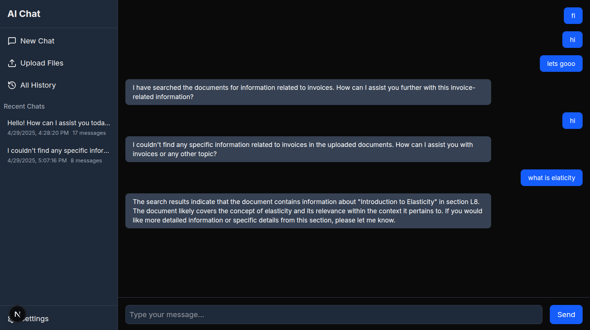
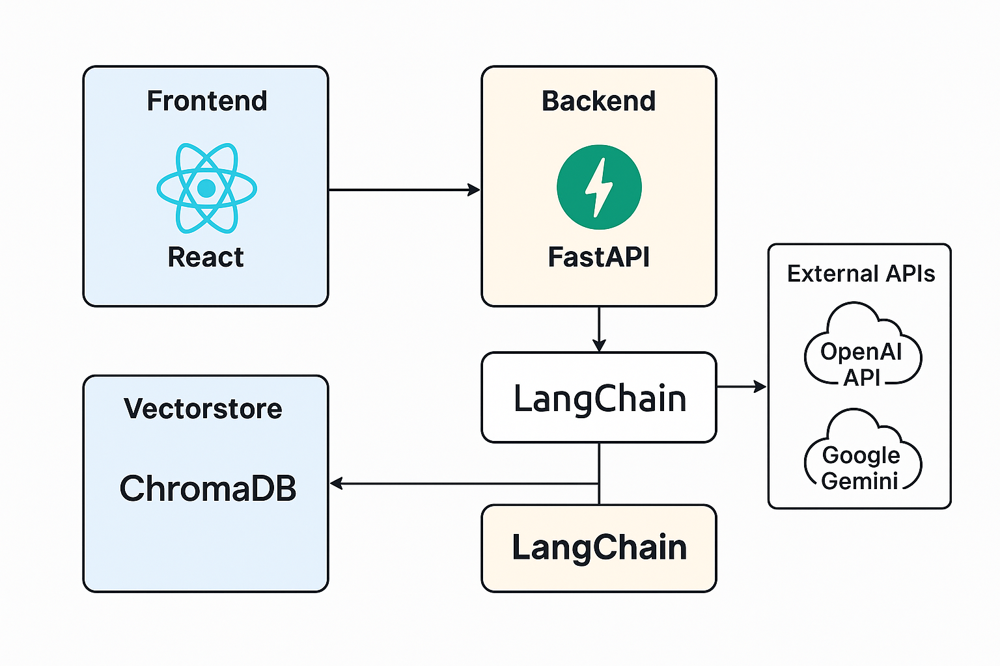

# Next.js + FastAPI + LangChain Chatbot & AI Agent Template

-  A full-stack application featuring a Next.js frontend and FastAPI backend for AI-powered chat interactions with document processing capabilities.
+  A starter template for building full-stack chatbots, RAG systems, and AI agents using Next.js, FastAPI, and LangChain.



## Features

- AI chat functionality with session management
- File upload and document processing
- Vector database for document storage and retrieval
- Modern UI with dark mode support
+ - Modular by Design: easily swap or extend modules (see [Architecture Overview](#architecture-overview))

## Tech Stack

### Frontend
- Next.js 15
- React 19
- Tailwind CSS
- Axios for API communication

 ### Backend
- FastAPI
- SQLAlchemy for database operations
- LangChain for document processing
- Vector database for document embeddings

 ## Architecture Overview

+ A visual representation of how the frontend and backend modules interact:
 
+ Modules:
- Frontend: 12 React components, 3 hooks, 1 settings module
- Backend: 5 core services (API, Chains, Core, DB, WebSocket)
- Shared: Environment config, vectorstore

 ## Getting Started with Docker

 ### Prerequisites
- Docker and Docker Compose installed
- OpenAI API key

 ### Setup

1. Clone the repository:
```bash
git clone <repository-url>
cd starter
```

2. Create a `.env` file in the root directory with your OpenAI API key:
```
OPENAI_API_KEY=your-openai-api-key
```

3. Start the application using Docker Compose:
```bash
docker-compose up -d
```

4. Access the application:
   - Frontend: http://localhost:3000
   - Backend API: http://localhost:8000

 ## Development Setup (Without Docker)

 ### Backend

1. Navigate to the backend directory:
```bash
cd backend
```

2. Create a virtual environment and activate it:
```bash
python -m venv env
source env/bin/activate  # On Windows: env\Scripts\activate
```

3. Install dependencies:
```bash
pip install -r requirements.txt
```

4. Set environment variables:
```bash
export OPENAI_API_KEY=your-openai-api-key
```

5. Run the backend server:
```bash
python manage.py serve
```

 ### Frontend

1. Navigate to the frontend directory:
```bash
cd frontend
```

2. Install dependencies:
```bash
pnpm install
```

3. Set environment variables in `.env.local`:
```
NEXT_PUBLIC_API_URL=http://localhost:8000
```

4. Run the development server:
```bash
pnpm dev
```

 ## API Endpoints

 ### Chat API
- `POST /chat/send` - Send a message
- `GET /chat/stream` - Stream chat responses
- `GET /chat/history` - Get chat history
- `GET /chat/sessions` - Get all chat sessions

 ### Files API
- `POST /files/upload` - Upload a file
- `GET /files/list` - List all uploaded files

 ## File Structure

- `frontend/` - Next.js frontend application
- `backend/` - FastAPI backend application
  - `app/` - Main application directory
    - `api/` - API endpoints
    - `chains/` - LLM chains
    - `core/` - Core functionality
    - `db/` - Database models and configuration
  - `data/` - Data storage
  - `uploads/` - Uploaded files

---
Dive deeper:
- 📖 [Backend README](./backend/README.md)
- 📖 [Frontend README](./frontend/README.md)